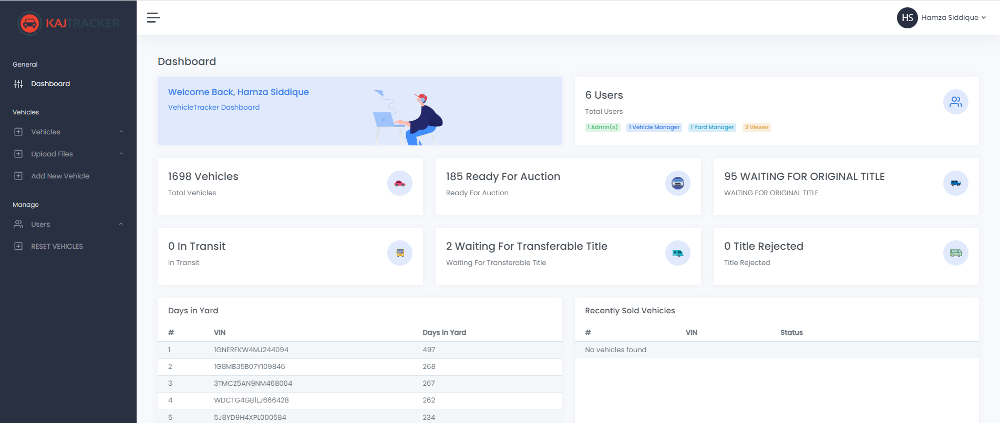
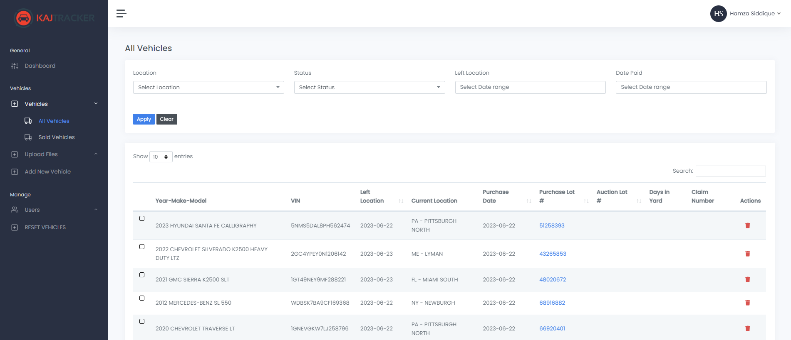
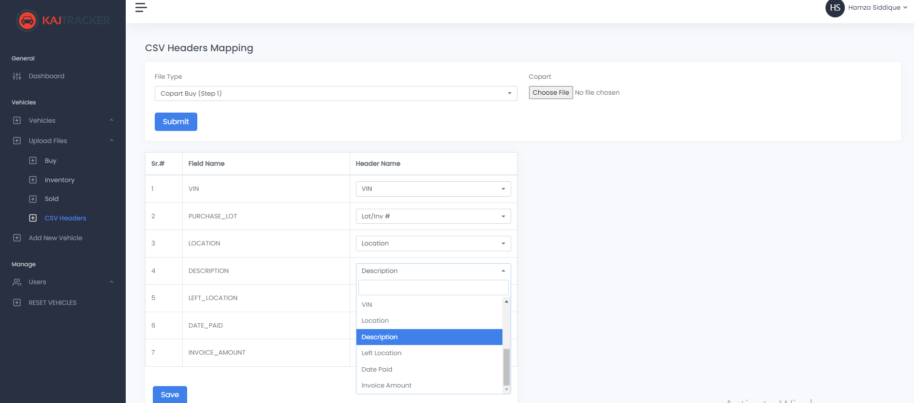

**Description:**
Laravel Based project: Vehicle Tracker 

1) Upload vehicles via CSV files
2) Keep track of vehicles e.g. particular vehicle is located in which area

**Admin Dashboard**

**All Vehicles Page**

**Map CSV Header Fields**

